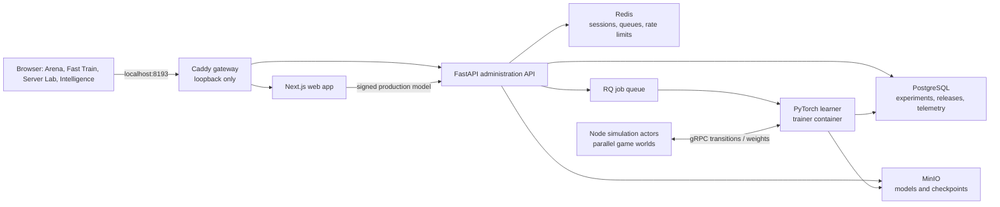
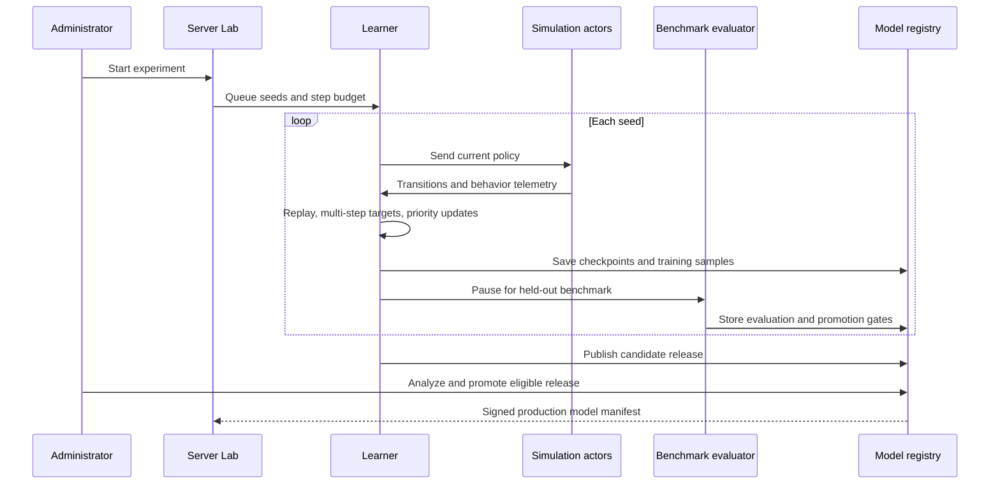

# Neon Serpents

Neon Serpents is a local multi-snake arena with reinforcement-learning agents.
It combines browser play with a Docker training lab for simulation, learning,
evaluation, checkpoints, and intelligence reporting on one machine.

Training data, models, administrator sessions, and backups remain local by
default.

## Features

- Responsive Next.js and React snake arena with configurable AI snakes.
- TensorFlow.js DQN for browser training and inference.
- Docker training lab: Node simulation actors, PyTorch learner, and gRPC.
- Survival, powerup, and battle curriculum with self-play and scripted agents.
- Prioritized replay, three-step returns, Double DQN, checkpoints, and model
  release promotion.
- Intelligence dashboard for loss, throughput, claims, reward sources, death
  causes, seed consistency, and candidate-versus-baseline benchmarks.

## Architecture



Only Caddy (`127.0.0.1:8193`) and the optional MinIO console
(`127.0.0.1:9001`) are published to the host. PostgreSQL, Redis, the API,
trainer, and actors remain on the internal Docker network.

## Training lifecycle



A **seed** is one independent repeatable training run. Several seeds show
whether an improvement is reliable instead of a lucky result.

## Quick start

### Prerequisites

- Docker Desktop with Linux containers enabled
- PowerShell on Windows
- Node.js 20+ and npm for browser-only development

### Start the local training lab

Create fresh local credentials once:

```powershell
.\ops\bootstrap-local.ps1
```

This creates `.env.docker`. It is ignored by Git and must never be shared.

Start the stack:

```powershell
docker compose --env-file .env.docker up --build -d
```

Open [http://localhost:8193](http://localhost:8193), then sign in to Server
Lab with the administrator password chosen during bootstrap.

Stop the stack while keeping its data:

```powershell
docker compose --env-file .env.docker down
```

### Run browser development

```powershell
npm install
npm run dev
```

Open [http://localhost:8193](http://localhost:8193).

## Product areas

| Area | Purpose |
| --- | --- |
| **Arena** | Run live battles using promoted production models. |
| **Fast Train** | Train a TensorFlow.js agent stored in the browser. |
| **Server Lab** | Start, pause, force-finish, cancel, benchmark, and promote Docker experiments. |
| **Intelligence** | Compare releases and inspect powerup behavior, losses, metrics, and gates. |
| **Model Registry** | Stores candidate and production releases with signed manifests. |

## What the agent learns

Observations cover board geometry, food, opponents, danger, powerups, and
relative game state. The curriculum deliberately exposes powerups before the
agent is expected to use them competitively:

1. **Survival**: movement, walls, obstacles, and basic food collection.
2. **Powerup lab**: every powerup kind at reachable distances and enough time
   to experience its effects.
3. **Battle mixture**: current-policy self-play, frozen checkpoints, and
   scripted safe, food-seeking, and powerup-contesting opponents.

The learner uses small potential-based approach shaping while claims and wins
remain the stronger incentives. Intelligence reports claims, ignored chances,
pursuit failures, food, survival, death causes, and reward components so a
single reward number cannot hide bad behavior.

## Experiment controls

An experiment trains each selected seed independently. The lab shows active
phase, elapsed phase time, total elapsed time, throughput, and a benchmark timer.
Benchmarking pauses learning for the active seed and the next seed continues
after that benchmark finishes.

- **Pause safely** saves progress at a safe checkpoint boundary.
- **Force finish** stops at the current usable checkpoint and evaluates it. It
  does not claim the planned training budget was completed.
- **Cancel and delete** permanently removes that experiment's checkpoints,
  exports, telemetry, releases, audit entries, and database record.
- **Promote** makes an eligible candidate the model used by Arena.

After promotion, watch the policy in Arena and compare the candidate with its
baseline in Intelligence. Win rate and held-out behavior matter more than a
single visual match or a high training reward.

## Operations

Check services and recent logs:

```powershell
docker compose --env-file .env.docker ps
docker compose --env-file .env.docker logs --tail=150 api trainer actors
```

Run the optional backup profile:

```powershell
docker compose --env-file .env.docker --profile backup run --rm backup
```

Delete all local Docker data, including PostgreSQL, Redis, MinIO models, and
checkpoints:

```powershell
docker compose --env-file .env.docker down --volumes
```

The last command is destructive. Restore only from a verified backup.

## Validation and desktop commands

```powershell
npm run typecheck
npm test
npm run build
docker compose --env-file .env.docker config --quiet
```

```powershell
npm run train:desktop -- --steps 1000000 --seed 42 --out .\artifacts\training
npm run benchmark:ai -- --candidate .\candidate.nsbrain.json --baseline .\baseline.nsbrain.json --matches 200
```

Generated models and training artifacts are excluded from source control.

## Security and public-source boundaries

This public source repository contains safe templates and code only. It does
not include `.env.docker`, database volumes, browser storage, training
artifacts, certificates, private keys, or real secrets.

- Keep `ALLOW_MANUAL_PROMOTION=false` in normal operation. It is a local
  full-coverage testing override, not a replacement for benchmark gates.
- The stack is loopback-only by design. Do **not** expose it to the internet
  without TLS, secure cookies, firewalling, and a dedicated deployment review.
- Read [SECURITY.md](SECURITY.md) before operating beyond a personal local
  machine.

## Repository layout

```text
src/       Browser game, DQN, UI, desktop tooling, and Node actors
server/    FastAPI API, trainer, storage, benchmarks, and tests
ops/       Docker images, Caddy, bootstrap, and backup scripts
proto/     Learner/actor gRPC protocol
public/    Static game assets
```

## Contributing

Do not commit credentials or generated training data. For changes to the
learner, compare the same environment-step budget across independent seeds and
report held-out confidence intervals, not only a single training curve.

## License

No open-source license is currently included. Public visibility does not itself
grant reuse rights; add a license before accepting outside reuse or
contributions.
